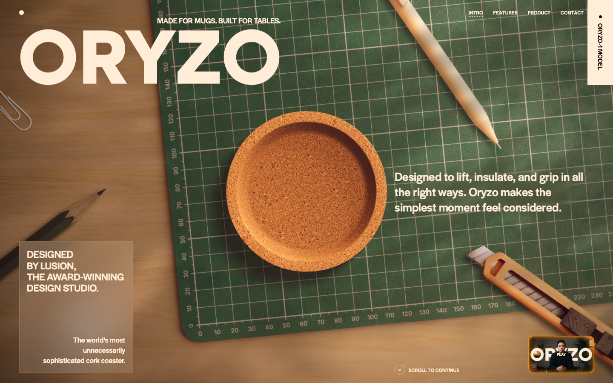
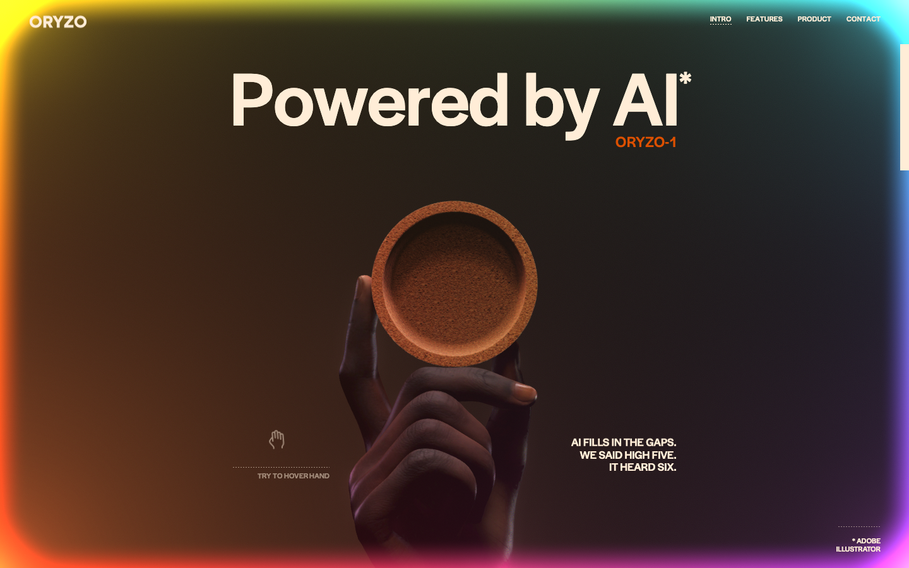
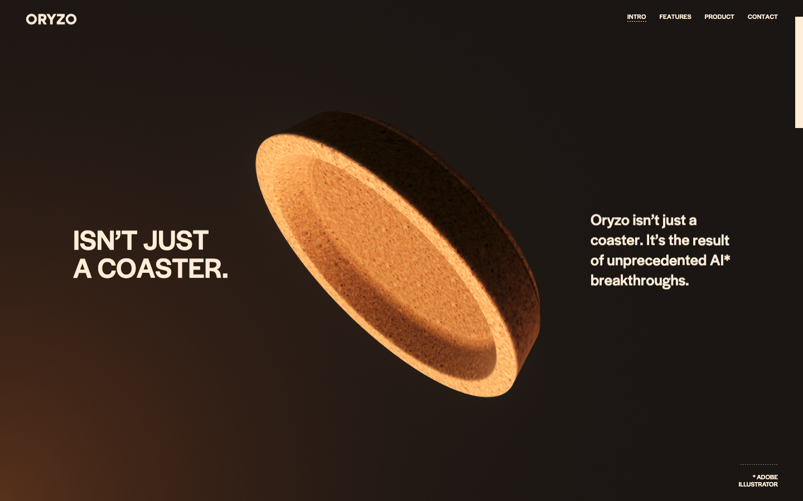
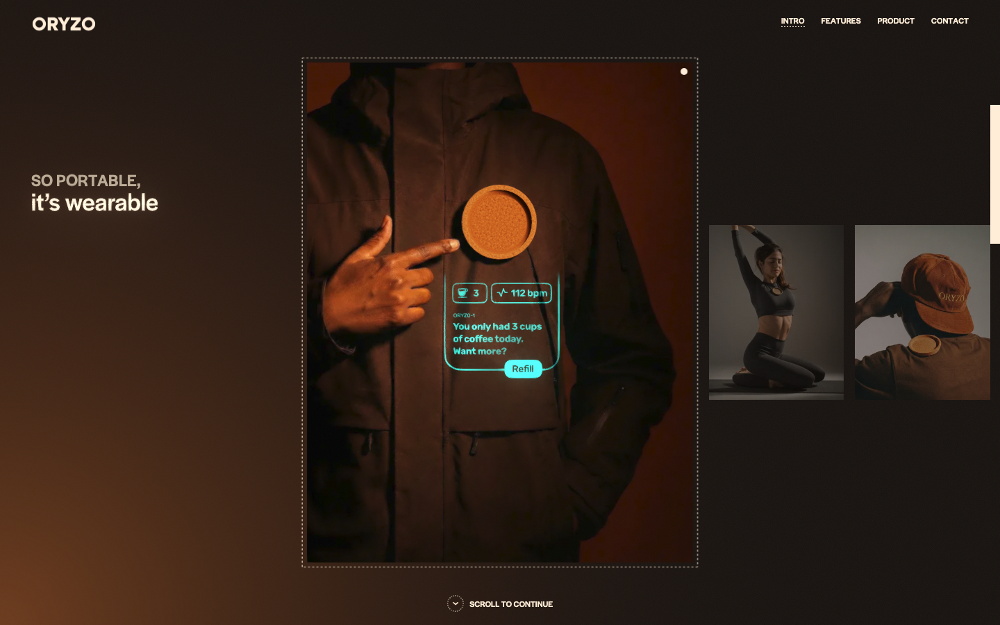
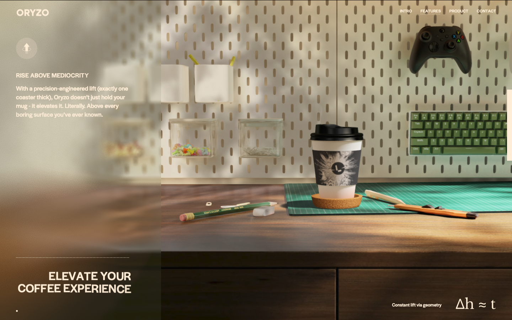
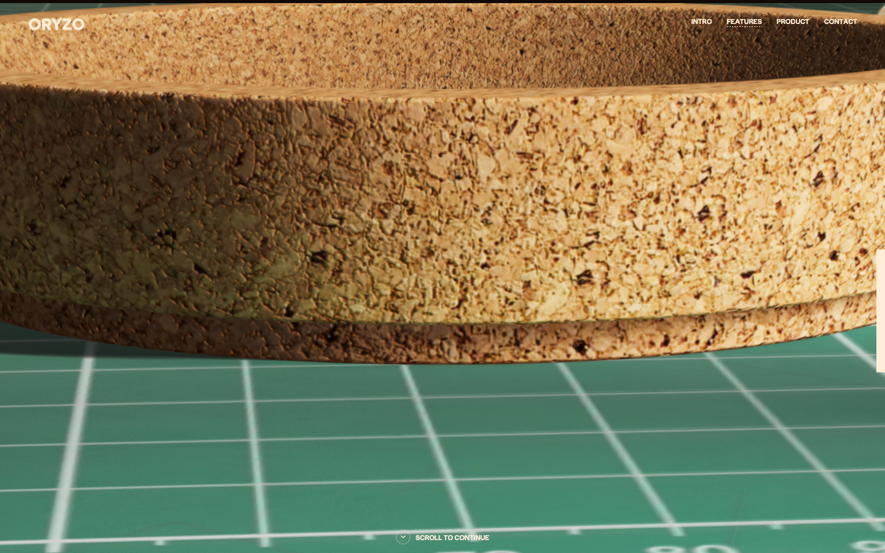
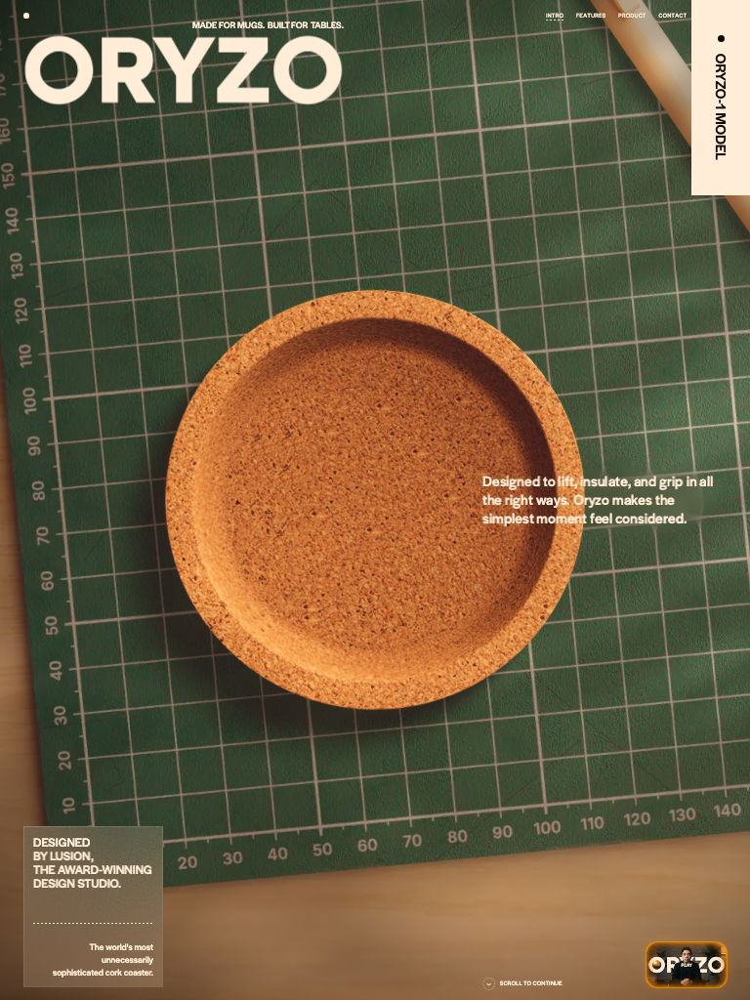

<div align="center">

# oryzoaicopybest3d


### a byte-perfect study mirror of oryzo.ai — Lusion's award-grade WebGL scroll experience, running from one folder

<p>
  
  
  
  
  
</p>

**the world's most unnecessarily sophisticated cork coaster, dissected for science.**

</div>

---

<p align="center">
  
</p>

## what is this

An educational, byte-perfect mirror of [oryzo.ai](https://oryzo.ai) — the satirical "AI-powered cork coaster" site built by [Lusion](https://lusion.co), the award-winning WebGL studio. The entire deployed build (HTML, compiled JS engine, every texture/model/splat) is captured here so the techniques behind it can be studied offline, section by section.

**Everything visual belongs to Oryzo / Lusion.** This repo is for learning only — not affiliated, not endorsed, not pretending to be them. (Even their "product" is a joke: the nav's GitHub link points to a fake `ORYZO-1` model repo.)

## gallery — shots captured from the live site

| | |
|---|---|
|  |  |
|  |  |
|  |  |

## how this mirror was made

1. **Reference pass** — a 90s screen recording of the live site was exploded into 903 frames (one every 0.1s) to map every section and animation beat.
2. **Core mirror** — the deployed Astro build was pulled as-is: `index.html`, the compiled CSS, and the single 1.1 MB JS bundle that contains the entire engine. Only change: analytics beacon removed.
3. **Static harvest** — every asset URL referenced in the HTML, CSS, and JS was extracted and downloaded (~120 files).
4. **Runtime harvest** — a headless browser scrolled the full page on desktop *and* mobile viewports while recording the network tab; the ~60 extra files the engine requests at runtime (splats, worker, wasm, baked animation buffers, mobile texture variants) were downloaded too.
5. **Verification** — repeat crawls on both viewports: **zero failed requests**; local screenshots pixel-match the live site.

## what's ours / theirs / external

| Layer | Contents |
|---|---|
| **Ours** | This README, `docs/SECTIONS.md`, `.gitignore`, the screenshots. Zero rendering code. |
| **Theirs (mirrored, runs locally)** | The full engine bundle, all CSS/HTML, ~180 assets: textures, `.buf` meshes, `.sog` splats, Rive file, videos, fonts, favicons. |
| **External (fetched live, same as the real site)** | Vimeo promo video, Adobe Typekit fonts (licensed — can't be self-hosted), Rive wasm runtime from CDN. |

## how the site actually works

The core trick: **almost nothing is live full 3D.** It's pre-baked renders layered with thin real-time effects — that's why it looks film-quality at 60fps.

- **Scroll** — a custom virtual smooth-scroll. The wheel never scrolls the page; it feeds a progress value that drives GSAP ScrollTrigger timelines *and* baked 3D camera paths in lockstep. Headlines reveal per-character via SplitText.
- **Desk hero** — one big pre-rendered background plate; each desk object (pencil, cutter, paperclips…) ships as a separate `_color` + `_alpha` texture pair composited as parallax layers in WebGL, so the scene shifts subtly with the mouse.
- **AI hand** — real geometry (`models/hand.buf` + baked `hand_animation.buf`) lit by prebaked environment maps. `.buf` is Lusion's custom mesh format — not glTF.
- **Coaster tumble** — `coaster_hero_animation.buf` + `hero_camera.buf`: pre-baked object and camera animation scrubbed directly by scroll position.
- **Features / coffee desk** — the hybrid showpiece: real meshes (`DESK`, `WALL`, `PINBOARD`, the coffee cup) with all lighting baked into textures, **Gaussian splats** (`splats/*.sog`, sorted by a wasm worker) supplying the photoreal table reflections and clutter, sprite-sheet smoke relit via precomputed spherical harmonics, and a scroll-scrubbed camera path (`featuresAnimations/CAMERA_ANIM.buf`). The ghost/space-invader easter eggs are 2D sprites (Rive handles the vector animation layer).
- **Text in 3D** — MSDF-rendered Inter (`fonts/msdf/`), crisp at any zoom inside WebGL.

Full section-by-section map: [`docs/SECTIONS.md`](docs/SECTIONS.md).

## building your own version of this

You can't meaningfully edit their minified bundle — rebuild with the same *techniques* instead:

1. **Stack**: Three.js + GSAP ScrollTrigger + Lenis in your own Vite/Astro project.
2. **Bake, don't simulate**: model your scene in Blender, render the background to a plate, export foreground objects as `_color`/`_alpha` cutouts → hero-style parallax for almost free.
3. **Scroll-scrubbed cameras**: export a Blender camera path and scrub it with scroll progress — that's the whole features section.
4. **Own everything**: your product renders, self-hosted fonts, your own video host.

## run it

```bash
npx serve .
# or
python3 -m http.server 4173
```

Open the printed localhost URL. Internet needed only for the three external pieces listed above.

Full setup guide — clone, serve, troubleshoot, repo map: **[SETUP.md](SETUP.md)**.
Recreating this from scratch with your own assets: **[REBUILD.md](REBUILD.md)**.

---

<div align="center">

**oryzoaicopybest3d** · educational mirror, all rights to Oryzo / Lusion · 2026 Matthew Park

[Original site](https://oryzo.ai) · [Lusion](https://lusion.co) · [GitHub](https://github.com/mattypark)

</div>
